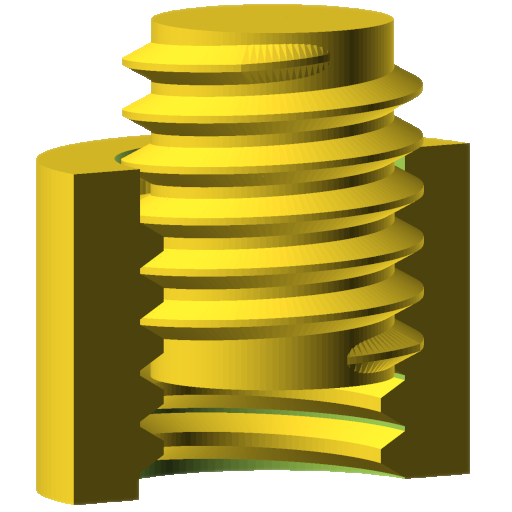

threadlib
+++++++++++++++++++++++++++

threadlib is a library of standard threads for OpenSCAD. It is based on Helges
excellent `threadprofile.scad
<https://github.com/MisterHW/IoP-satellite/tree/master/OpenSCAD%20bottle%20threads>`__
to create nice threads with lead-in / lead-out tapers. Check out his `article on
generating nice threads
<https://hackaday.io/page/5252-generating-nice-threads-in-openscad>`__ on
Hackaday.

In contrast to other thread libraries, threadlib does not make you look up
diameters and pitches and maybe even thread-profiles in tables and norms: It has
these tables built in.

Creating a thread is as simple as

.. code-block:: OpenSCAD

        thread("G1/2-ext", turns=10, higbee_arc=20);

to create a British Standard Pipe parallel external thread. Furthermore,
threadlib allows for production tolerances by choosing thread dimensions well
inside the ranges allowed by the norms.

Usage
===========================

To create a bolt (without head) with 5 turns of M4 thread:

.. code-block:: OpenSCAD

        bolt("M4", turns=5);

.. image:: docs/imgs/bolt-M4.png
        :width: 30%
        :alt: Bolt with M4 thread

A nut:

.. code-block:: OpenSCAD

        nut("M12x0.5", turns=10, Douter=40);

.. image:: docs/imgs/nut-M12x0.5.png
        :width: 30%
        :alt: M12x0.5 nut

Note that for a nut you also have to specify an outer diameter. The inner
diameter is implicitly given by the thread designator ("M12x0.5" in this case).

If you only need the threads alone:

.. code-block:: OpenSCAD

        thread("G2 1/2-ext", turns=5);

Then, add the support you want. In the simplest case, a cylinder (which is what
nut(...) uses):

.. code-block:: OpenSCAD

        specs = thread_specs("G2 1/2-ext");
        P = specs[0]; Rrot = specs[1]; Dsupport = specs[2];
        section_profile = specs[3];
        H = (5 + 1) * P;
        translate([0, 0, -P / 2])
            cylinder(h=H, d=Dsupport, $fn=120);

Here, we have used the function thread_specs(...) to look up the threads
specifications - including the recommended diameter of the support structure.

List of supported threads
===========================

Currently, threadlib knows these threads:

- British Standard Pipe Parallel Threads G1/16 to G6
- Metric threads (coarse, fine, and super-fine pitches) M0.25 to M600

Extensibility
===========================

Don't find some of the threads you need for your project? Don't worry: You can
add your own:

.. code-block:: OpenSCAD

        use <threadlib/threadlib.scad>

        MY_THREAD_TABLE = [
                           ["special", [pitch, Rrot, Dsupport,
                           [[r0, z0], [r1, z1], ..., [rn, zn]]]]
                           ];

        thread("special", turns=15, table=MY_THREAD_TABLE);

Care to share? Safe others from repeating the valuable work you have already
accomplished and get the fame you deserve: Send in your tried and tested threads
for addition to threadlib!

Change Log
===========================

- 0.2: Metric threads
- 0.1: Initial release supporting BSP parallel thread

