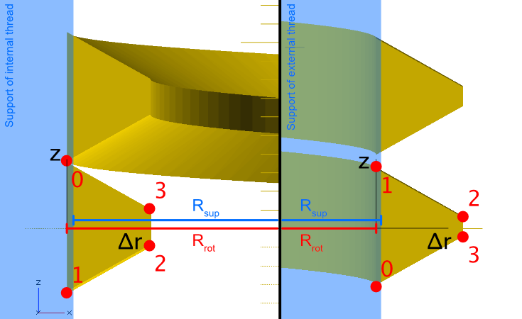

# The Calculations Behind BSP-Parallel Thread

The general approach is described in [Creating Thread Specs](./CreatingThreadSpecs.md). We explain the math here. The following figure is of great help to understand what is going on. Black profile: theoretical parting line. The profiles we are going to create are red (internal thread) and blue (external thread). Note that the red and blue profiles are drawn assuming identical pitch diameters for both to clarify the figure. However, in reality external and internal threads do not have the same pitch diameter (see below).

The relevant translation in done in the function calculateThreadlibSpecs() in BSPP_thread.awk.

Steps:

- Pitch (P): Taken from table BSPP_thread.csv
- Pitch diameter: external threads aim for a somewhat smaller pitch diameter (DPitchExt), internal threads for a larger one (DPitchInt). threadlib aims at the center of the acceptable range given in BSPP_thread.csv. For external thread, we have to choose between class A and class B. We decided for class A.
- Major diameter (for external thread, think minor diameter for internal thread) is chosen in the center of the acceptable range given in BSPP_thread.csv => DMaxExt, DMinInt
- Support diameter (DSupportExt, DSupportInt): Must be on the right side of the parting line. Otherwise no requirements from the norm. We choose the pitch diameter +/- 2 * 5/12 * H, where H is the full height of the fundamental triangle and +/- depends on external / internal thread. This is the middle between intended major / minor diameter and the corner of the fundamental triangle.
- The valleys of the actual part will be defined by the support (see above). The valleys of the profile are chosen to overlap somewhat with the support => DValleyExt, DValleyInt (these correspond to Rrot).

However, this is not yet what we need. As we do not want the rounding in the profile, we have to adjust the "crest" diameters of the straightened profile accordingly. Again, the criterion is to create a profile that strictly remains on its own side of the parting line.

Finally, we need the points (dr_i, z_i) of the thread profile. The radii are
simple: 0, 0, (DCrest - DValley) / 2, (DCrest - DValley) / 2.  To calculate the corresponding z-values, we use the triangle given by (half of) the crest / valley line and the corner of the fundamental triangle (compare first figure).  Half of the lines length is then calculated as the height of said triangle times tan(phi/2). Using this we calculate all 4 z-values from the crest- and valley radii.

