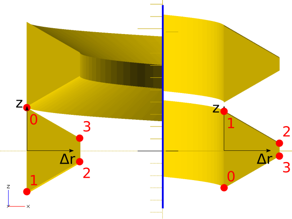

# Design of threadlib

The structure of threadlib is very simple and consists of only two files:

- threadlib.scad
- THREAD_TABLE.scad

The former provides the code to generate threads, bolts, and nuts. The latter simply holds a large dictionary (named THREAD_TABLE) providing the thread-specs given a thread-designator.

THREAD_TABLE is a vector of vectors called "entries". Every entry has the following format:

    [DESIGNATOR, [P, Rrot, Dsup, profile]]

where

- DESIGNATOR: Name of thread. E.g. "M6x0.5-ext"
- P: Pitch of the thread
- Rrot: Radius of rotation used for later "extrusion" of the thread. Rrot is positive for external threads and negative for internal threads.
- Dsup: Recommended diameter of support structure of the thread (i.e., of cylinder for external thread and hole for internal thread)
- profile: A vector of 2D [delta_r, z]-vectors describing the shape of the thread

Let's look at an example:

    ["M4-int", [0.7, -2.1095, 4.1095,
                [
                 [0, 0.3465], 
                 [0, -0.3465], 
                 [0.43304671, -0.09648036], 
                 [0.43304671, 0.09648036]
                ]]]

## Definition of profile

profile is a list of vectors in OpenSCADs x-y plane. x corresponds to the radial direction of the screw, z is the axis of the threads helix.

In many cases, profile consists of 4 points. However, the number of points is not limited: You can use as many as you need. For external threads, the profile is specified in the right-hand side of the x-y plane. For internal threads, the left-hand side is used (i.e., the radius-values are negative). This is useful to make corresponding male and female threads match without extra operations: The female thread has rotated by half a turn when it arrives on the right-hand side of the x-y plane, thereby nicely fitting in between two turns of the male thread.

## Redundancy?

Why do we need P, Rrot, Dsup, *and* profile? Can we not include everything in profile? Unfortunately, we can't. The reasons are a) lead-in / lead-out tapers ("lilo-tapers") and b) overlap between thread and support to avoid rendering problems.

*lilo-tapers*: To make the tapers, the profile is scaled-down at the ends. We need to know where the profile is scaled to (center of scaling). We solve this by specifying the radius of rotation for extrusion Rrot explicitly and subtract it from profile (profile holds [dr, z] instead of [r, z]). lilo-tapers are then created by scaling towards dr=0.

*Overlap 1*: We could include P in profile by requiring that profile extends over exactly one period (i.e., P). However, this would result in a helix where neighboring periods would exactly touch each other. This leads to rendering artifacts => P is stored separately and profile is *required* to cover *less* than a period. 

*Overlap 2*: But hey! Dsup = 2 * Rrot, no? In principle yes, but in that case thread and bolt would *just* touch => rendering problems. But we could implicitly assume that Rrot is simply 1% smaller than Dsup / 2 for external threads (and 1% larger for internal threads)! Yes, we could. But we decided to make that choice explicit rather than implicit.

