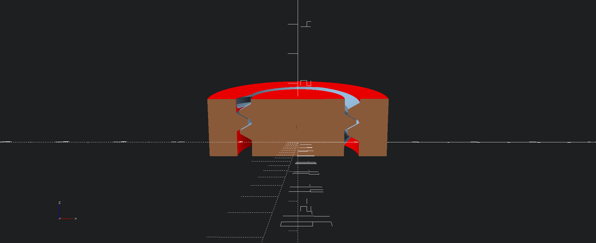
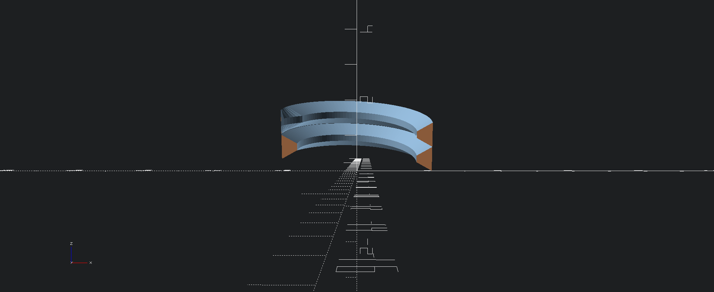
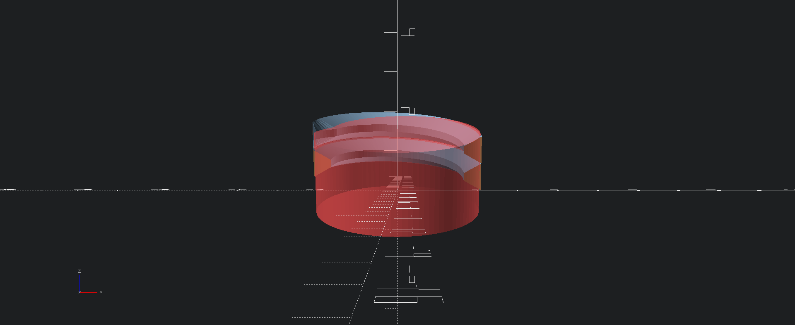
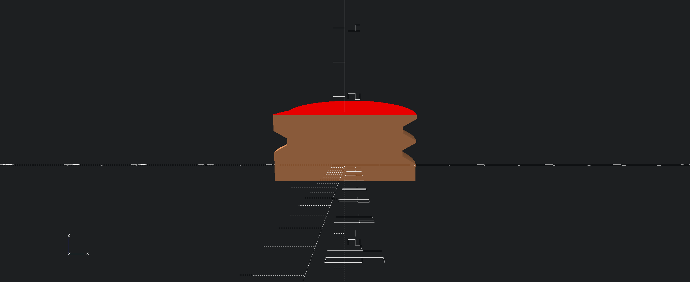
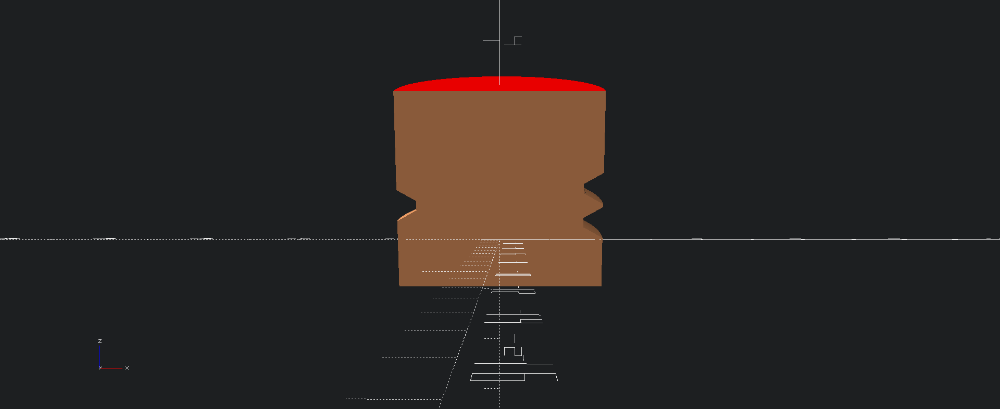
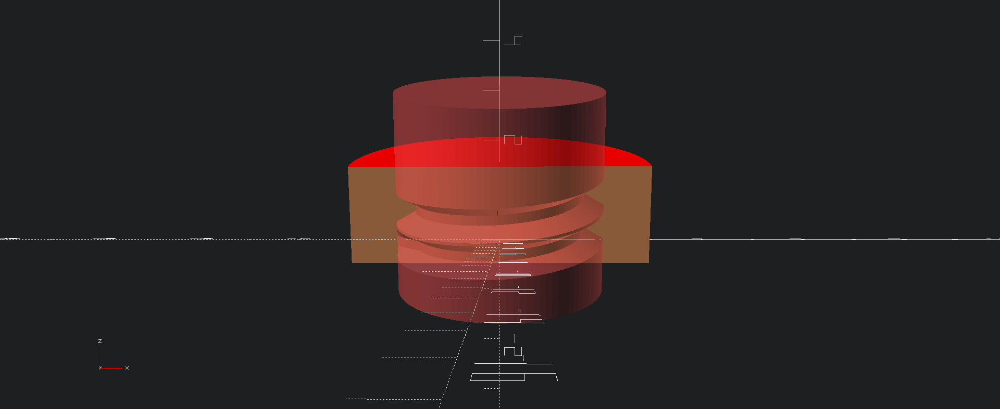
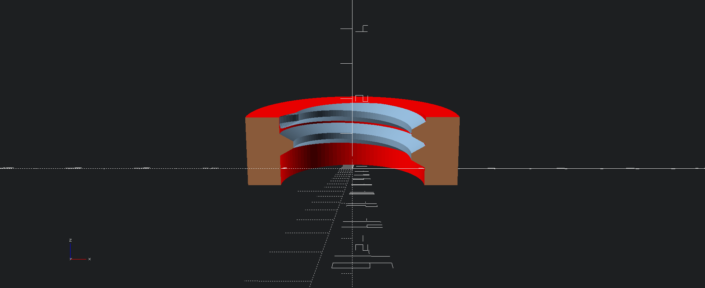
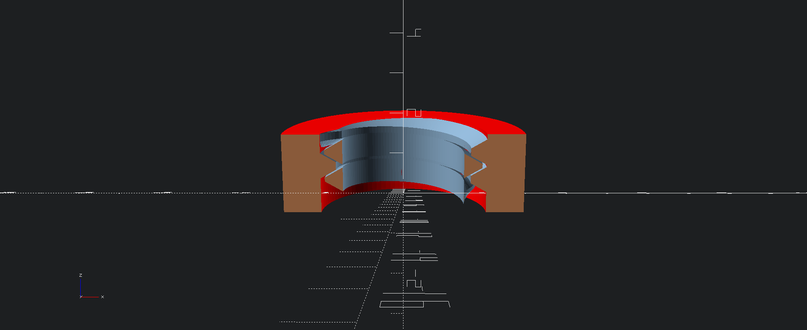

# Design of threadlib

The structure of threadlib is very simple and consists of only two files:

- threadlib.scad
- THREAD_TABLE.scad

The former provides the code to generate threads, bolts, and nuts. The latter simply holds a large dictionary (named THREAD_TABLE) providing the thread-specs given a thread-designator.

THREAD_TABLE is a vector of vectors called "entries". Every entry has the following format:

    [DESIGNATOR, [P, Rrot, Dsup, profile]]

where

- DESIGNATOR: Name of thread. E.g. "M6x0.5-ext"
- P: Pitch of the thread
- Rrot: Radius of rotation used for later "extrusion" of the thread. Rrot is positive for external threads and negative for internal threads.
- Dsup: Recommended diameter of support structure of the thread (i.e., of cylinder for external thread and hole for internal thread)
- profile: A vector of 2D [delta_r, z]-vectors describing the shape of the thread

Let's look at an example - the M4:

    ["M4-int", [0.7, -2.1095, 4.1095, [[0, 0.3465],     [0, -0.3465],   [0.43304671, -0.09648036],  [0.43304671, 0.09648036]]]],
    ["M4-ext", [0.7,  1.5010, 3.1110, [[0, -0.3124],    [0, 0.3124],    [0.4530, 0.0509],           [0.4530, -0.0509]       ]]],

## Overview 

While each thread profile is defined individually, they have a naming convention ( -int, -ext ) and are meant to work togenter. The following is an overview of how they relate.

The designator is the name of the thread "M4-int" or "M4-ext". The "-int" and "-ext" are not necessary to create a thread, it is encouraged to create them as they are used  with the helper functions - bolt, nut and tap - and an error will occure if the coresponding "-ext" ( for bolt ) or "-int" ( for nut and tap ) profiles do not exist.

- The Bolt is the union of the "-ext" thread and a cylynder of diameter "Dsup".
- The Tap is the difference of a cyliner of diamter "Dsup" minus "-int" thread.
- The Nut is the cylyder of diameter Douter minus the Tap. 

This arrangement of two profiles allows us to add in tollerences so the bolt can properly fit into the tap/nut .

The following is the `thread("M4-int")`. The INT is used to designate a thread on the INSIDE of something. For the parameters, Rrot is the radius of rotation. In the image, this coresponds to the outer radius of the thread. 

The following illustrates the thread with the supporting cylinder drawn in. The Diamter of the supporting cylinder, in the case of the interior thread, will be smaller than than the diameter (2xRrot) of the interior thread.

If we take the difference of the supporting cylinder and the thread, you get the `tap("M4")`. When using the tap method, the `-int`is added to the base designator. This means the diameter of the tap will be Dsup. 

This is the tap extended to make it obvious.

The following displays the cylinder drawn by the douter paramter in the `nut("M4", douter=6)` module, with the M4 tap illustrated. Again, notice how we do not request "-int", it is appended to the designator.

The difference of the douter cylinder and the tap will result in nut from `nut("M4", douter=6)`.

We can now add the thread, `thread("M4-ext")`, "-ext" as it is on the exteririor of a cylynder. In this case the Rrot of the profile is the interior surface of the thread, and should be smaller than the diameter of the supporting cylinder.

Finally, if we add the support cylinder - dsup - we get the resulting `bolt("M4")`. The Dsup parameter in this case is the diameter of the thread valley of the bolt.  

## Definition of profile

profile is a list of vectors in OpenSCADs x-y plane. x corresponds to the radial direction of the screw, z is the axis of the threads helix.

In many cases, profile consists of 4 points. However, the number of points is not limited: You can use as many as you need. For external threads, the profile is specified in the right-hand side of the x-y plane. For internal threads, the left-hand side is used (i.e., the radius-values are negative). This is useful to make corresponding male and female threads match without extra operations: The female thread has rotated by half a turn when it arrives on the right-hand side of the x-y plane, thereby nicely fitting in between two turns of the male thread.

## Redundancy?

Why do we need P, Rrot, Dsup, *and* profile? Can we not include everything in profile? Unfortunately, we can't. The reasons are a) lead-in / lead-out tapers ("lilo-tapers") and b) overlap between thread and support to avoid rendering problems.

*lilo-tapers*: To make the tapers, the profile is scaled-down at the ends. We need to know where the profile is scaled to (center of scaling). We solve this by specifying the radius of rotation for extrusion Rrot explicitly and subtract it from profile (profile holds [dr, z] instead of [r, z]). lilo-tapers are then created by scaling towards dr=0.

*Overlap 1*: We could include P in profile by requiring that profile extends over exactly one period (i.e., P). However, this would result in a helix where neighboring periods would exactly touch each other. This leads to rendering artifacts => P is stored separately and profile is *required* to cover *less* than a period. 

*Overlap 2*: But hey! Dsup = 2 * Rrot, no? In principle yes, but in that case thread and bolt would *just* touch => rendering problems. But we could implicitly assume that Rrot is simply 1% smaller than Dsup / 2 for external threads (and 1% larger for internal threads)! Yes, we could. But we decided to make that choice explicit rather than implicit.

