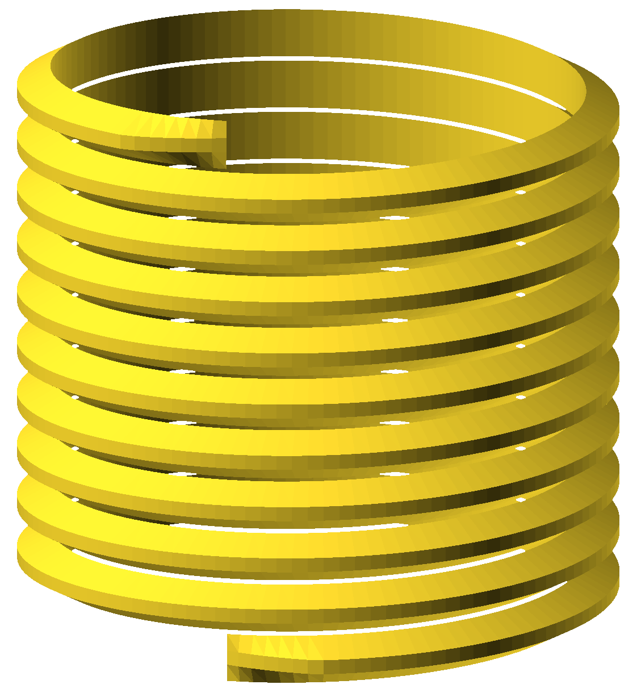
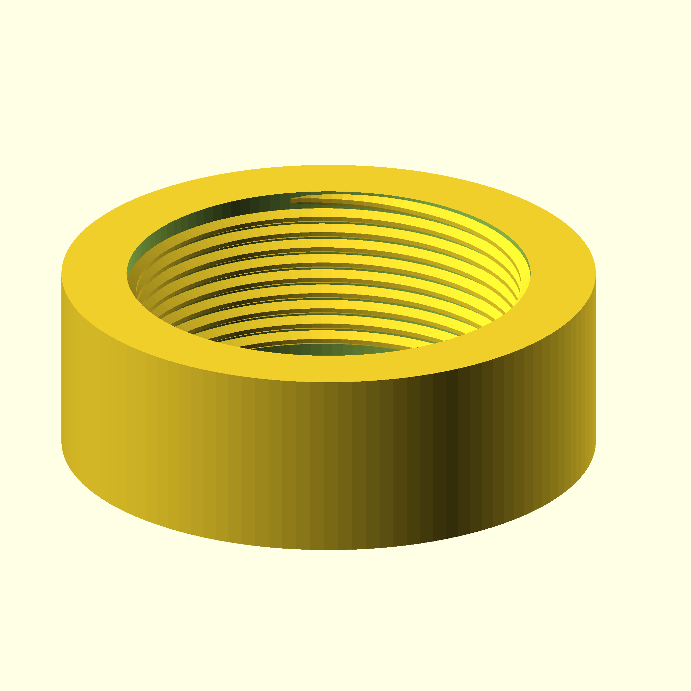
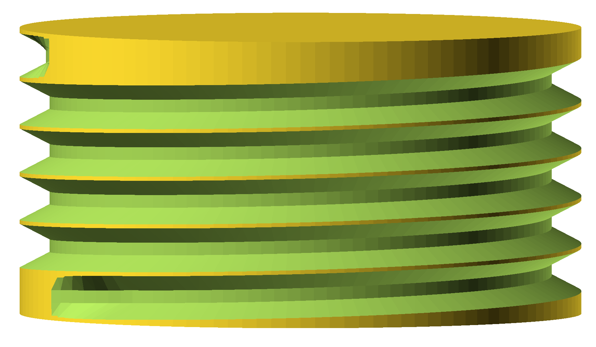

threadlib is a library of standard threads for `OpenSCAD <https://www.openscad.org>`__.
It is based on Helges excellent
`threadprofile.scad <https://github.com/MisterHW/IoP-satellite/tree/master/OpenSCAD%20bottle%20threads>`__
to create nice threads with lead-in / lead-out tapers. Check out his `article on generating nice threads <https://hackaday.io/page/5252-generating-nice-threads-in-openscad>`__
on Hackaday.

In contrast to other thread libraries such as `openscad-threads <http://dkprojects.net/openscad-threads/>`__,
`yet another thread library <https://www.thingiverse.com/thing:2277141>`__,
`threads for screws and nuts V1 <https://www.thingiverse.com/thing:3131126>`__,
and `threading.scad <https://www.thingiverse.com/thing:1659079>`__,
threadlib does not make you look up diameters and pitches and maybe even
thread-profiles in tables and norms: It has these tables built in.

Creating a thread is as simple as

.. code-block:: OpenSCAD

        use <threadlib/threadlib.scad>
        thread("G1/2-ext", turns=10);

to create a British Standard Pipe parallel external thread. 

Why you may want to use threadlib
==================================

- really easy to use
- creates nice threads
- configurable higbee arc
- creates working threads (clearances are left for production tolerances)
- flexible:

  - choose the $fn you need to fit the rest of your design
  - let threadlib tell you the thread specs so you can do with them what *you* want
- extensible: Add your own threads
- tried and tested in the real world: Well, partly. Given the sheer number of
  threads, this is only possible with *your* help! Any feedback regarding working
  (or not working) threadlib-threads is appreciated.

Installation
===========================

Prerequisits:

- `openscad/scad-utils <https://github.com/openscad/scad-utils>`__
- `list-comprehension <https://github.com/openscad/list-comprehension-demos>`__
- `threadprofile.scad <https://github.com/MisterHW/IoP-satellite/blob/master/OpenSCAD%20bottle%20threads/thread_profile.scad>`__
  
Save all of these into your OpenSCAD `library folder <https://en.wikibooks.org/wiki/OpenSCAD_User_Manual/Libraries>`__

threadlib:

Clone threadlib into the folder 'threadlib' inside your OpenSCAD library folder

Your libraries folder should now look similar to this:

::

    libraries
    ├── list-comprehension-demos/
    ├── scad-utils/
    ├── thread_profile.scad
    └── threadlib/

Usage
===========================

Before you start: threadlib is designed in millimeters (not meters, not inches).
Make sure that your units are set accordingly or scale the output of threadlib
to match the units you use in your project!

To create a bolt (without head) with 5 turns of M4 thread:

.. code-block:: OpenSCAD

        bolt("M4", turns=5, higbee_arc=30);

See these nice lead-in / lead-out tapers? Try a nut (this time using the default
argument for higbee_arc):

.. code-block:: OpenSCAD

        nut("M12x0.5", turns=10, Douter=16);

Note that for a nut you also have to specify an outer diameter. The inner
diameter is implicitly given by the thread designator ("M12x0.5" in this case). You can set the number of sides for the nut! So you can make hex nuts:

.. code-block:: OpenScad

        nut("M30", turns=4, Douter=46, nut_sides=6); 

To make a threaded hole (e.g. in a plate), an intuitive approach would be to
create the difference of the plate and a bolt. However, this part would not work
well in practice: You need a little space around the bolt to avoid collisions.
threadlib's solution is to provide the tap module:

.. code-block:: OpenSCAD

        tap("G1/2", turns=5);

The tap shown above *is* intended for use like this and has accounted for the
allowances needed in practice. Also, it will create the tapers:

.. code-block:: OpenSCAD

   difference() {
        part_to_be_tapped_here();
        tap("G1/2", turns=5);
   }

Make sure that the tap extends a tiny bit out of the part to be tapped.
Otherwise, you will end up with infinitely thin artifacts covering the entrance
of your tapped hole.

If you only need the threads alone:

.. code-block:: OpenSCAD

        thread("G1/2-ext", turns=5);

 
(Note: You need to specify whether you want internal ("-int") or external
("-ext") thread here.) Then, add the support you want. In the simplest
case, a cylinder (which is what nut(...) uses):

.. code-block:: OpenSCAD

        specs = thread_specs("G1/2-ext");
        P = specs[0]; Rrot = specs[1]; Dsupport = specs[2];
        section_profile = specs[3];
        H = (5 + 1) * P;
        translate([0, 0, -P / 2])
            cylinder(h=H, d=Dsupport, $fn=120);

.. image:: imgs/flexible.png
        :alt: G1/2 bolt

Here, we have used the function thread_specs(...) to look up the threads
specifications - including the recommended diameter of the support structure.

List of supported threads
===========================

Currently, threadlib knows these threads:

- Metric threads (coarse, fine, and super-fine pitches) M0.25 to M600.
- Unified Inch Screw Threads (UNC, UNF, UNEF, 4-UN, 6-UN, 8-UN, 12-UN,
  16-UN, 20-UN, 28-UN, and 32-UN). All threads are class 2 threads.
- `BSP parallel thread
  <https://www.amesweb.info/Screws/British-Standard-Pipe-Parallel-Thread-BSPP.aspx>`__
  G1/16 to G6. All threads are class A threads.
- `PCO-1881
  <https://www.bevtech.org/assets/Committees/Packaging-Technology/20/3784253-20.pdf>`__
  and `PCO-1810 <https://www.isbt.com/assets/Threadspecs/pco1810.pdf>`__
  (PET-bottle thread)
- Royal Microscopical Society's Thread (RMS)

Extensibility
===========================

Don't find some of the threads you need for your project? Don't worry: You can
add your own:

.. code-block:: OpenSCAD

        use <threadlib/threadlib.scad>

        MY_THREAD_TABLE = [
                           ["special", [pitch, Rrot, Dsupport,
                           [[r0, z0], [r1, z1], ..., [rn, zn]]]]
                           ];

        thread("special", turns=15, table=MY_THREAD_TABLE);

Care to share? Safe others from repeating the valuable work you have already
accomplished and get the fame you deserve: Send in your tried and tested
threads for addition to threadlib! See `How to contribute <./CONTRIBUTING.md>`_
for help on how to become a contributor.

Still reading?
===========================

If you read this far, you're probably not here for the first time. If you
use and like threadlib, would you consider giving it a Github Star? (The
button is at the top of this website.)

Contributing
===========================

Did you find a bug and would like to report it? Or maybe you've fixed it
already or want to help fixing it? That's great! Please read
[CONTRIBUTING](./CONTRIBUTING.md) to learn how to proceed.

To help ascertain that contributing to this project is a pleasant experience,
we have established a [code of conduct](./CODE_OF_CONDUCT.md). You can expect
everyone to adhere to it, just make sure you do as well.

Change Log
===========================

- 0.5: Royal Microscopical Society's thread (RMS)
- 0.4: `PCO-1810 <https://www.isbt.com/assets/Threadspecs/pco1810.pdf>`__.
  tap module. Fixes bug with $fn in straight_thread(). Lists metric
  threads under short designator and full designator.
- 0.3: Unified Inch Screw Threads (UNC, UNF, UNEF, 4-UN, 6-UN, 8-UN, 12-UN,
  16-UN, 20-UN, 28-UN, and 32-UN. Fixed problem with PCO-1881-int. Fixed problem
  with G-ext threads. New build system. 
- 0.2: Metric threads, `PCO-1881 <https://www.bevtech.org/assets/Committees/Packaging-Technology/20/3784253-20.pdf>`__
- 0.1: Initial release supporting `BSP parallel thread <https://www.amesweb.info/Screws/British-Standard-Pipe-Parallel-Thread-BSPP.aspx>`__
